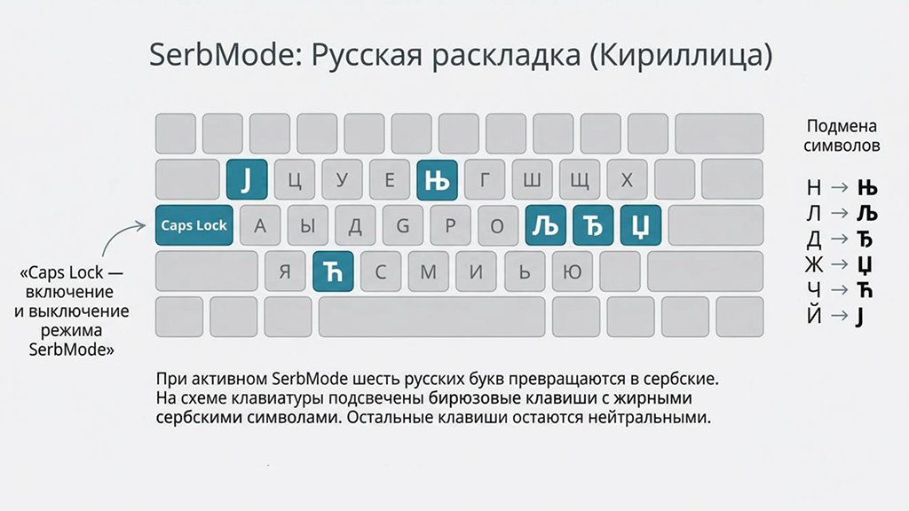
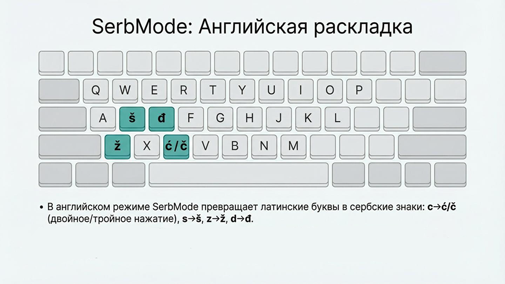

# serbian_caps (SerbMode)

Неудобно набирать сербский текст, когда на клавиатуре только русская и английская раскладки?  
Этот скрипт превращает твою обычную клавиатуру в «сербский режим» — без установки сербских раскладок в Windows!

Просто запускаешь скрипт или .exe файл — и можешь набирать сербскую кириллицу и латиницу поверх RU/EN.

## Основные возможности

- Переключение режима одной клавишей: **Caps Lock**
- Индикатор режима: **лампочка Scroll Lock** (горит — режим активен)
- Заглавные буквы — только через **Shift** (Caps Lock на регистр не влияет)
- При желании, возможно запустить скрипт в **AutoHotkey v2**, без использования .exe файла

## Как пользоваться

1. Скачай .exe файл, файл не требует установки и может находиться в любом месте на твоём ПК
2. Запусти .exe файл, в правом нижнем углу в области уведомлений (рядом с часами) появится сербский флаг
3. Нажми **Caps Lock** — режим включён (лампочка Scroll Lock на клавиатуре загорится)
4. Всё готово - набирай сербские тексты! 
5. Переключение между латиницей и кириллицей производится стандартным для тебя способом, он не меняется (Alt+Shift, Win+Space и т.п.).
6. Если нужно отключить сербский режим - нажми **Caps Lock** — режим выключён (лампочка Scroll Lock на клавиатуре не горит)
7. Удаление программы с компьютера производится простым удалением .exe файла

## Какие клавиши дают сербские буквы

1. Русская раскладка клавиатуры:

| Раскладка | Клавиша          | Результат (маленькая) | Результат (заглавная)  |
|-----------|------------------|-----------------------|------------------------|
| RU        | Й                | ј                     | Ј                      |
| RU        | Л (двойное)      | љ                     | Љ                      |
| RU        | Н (двойное)      | њ                     | Њ                      |
| RU        | Ж (двойное)      | џ                     | Џ                      |
| RU        | Ч (двойное)      | ћ                     | Ћ                      |
| RU        | Д (двойное)      | ђ                     | Ђ                      |

2. Английская раскладка клавиатуры:

| Раскладка | Клавиша          | Результат (маленькая) | Результат (заглавная)  |
|-----------|------------------|-----------------------|------------------------|
| EN        | C (двойное)      | ć                     | Ć                      |
| EN        | C (тройное)      | č                     | Č                      |
| EN        | S (двойное)      | š                     | Š                      |
| EN        | Z (двойное)      | ž                     | Ž                      |
| EN        | D (двойное)      | đ                     | Đ                      |

Двойное - два раза быстро нажать на одну кнопку
Тройное - три раза быстро нажать на одну кнопку

## Скачать готовый .exe

Вот [последняя версия в .exe](https://github.com/jazator/serbian_caps/releases/download/v1.0.1/serbian_caps.exe).

## Лицензия

MIT License — делай что хочешь.

## Наглядное пособие

1. Русская клавиатура

2. Английская клавиатура

Готово — теперь сербский текст набирается так же легко, как русский или английский!  
Если понравилось — поставь звезду ★
